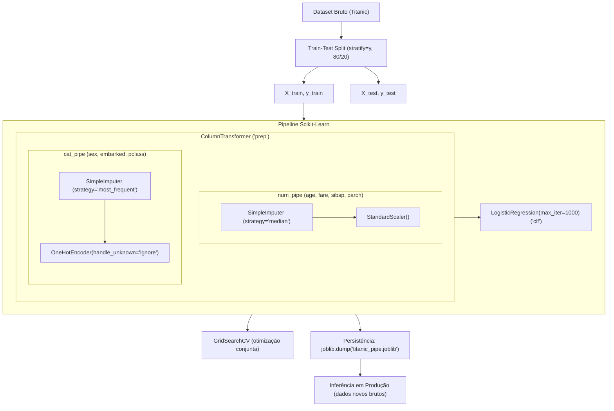

# Aula 5.3: Pipelines de Pré-processamento, Feature Engineering e Modelagem (Titanic)

Este módulo aborda a construção de pipelines robustos de Machine Learning no Scikit-Learn, focando em boas práticas de engenharia de dados, prevenção de vazamento de dados (*data leakage*), transformações customizadas, interpretabilidade, busca de hiperparâmetros e persistência de modelos para produção.

---

## Objetivos de Aprendizado

- **Prevenção de Data Leakage**: Garantir que transformações estatísticas (como média, mediana e desvio padrão) sejam calculadas estritamente no conjunto de treino.
- **Transformações Heterogêneas**: Tratar variáveis numéricas e categóricas de forma independente utilizando `ColumnTransformer`.
- **Encadeamento de Etapas**: Construir e aninhar `Pipeline`s para imputação, escalonamento e codificação.
- **Feature Engineering Avançada**:
  - Transformações matemáticas com `FunctionTransformer` (ex.: logarítmica para distribuições assimétricas).
  - Criação de transformadores personalizados via `BaseEstimator` e `TransformerMixin`.
- **Interpretabilidade**: Extrair os nomes das features geradas e inspecionar os coeficientes da regressão logística.
- **Otimização Global**: Ajustar hiperparâmetros do pré-processador e do modelo simultaneamente através de `GridSearchCV`.
- **Deploy e Persistência**: Salvar e carregar o pipeline completo com `joblib`, simulando inferência sobre novos passageiros com dados ausentes.

---

## Arquitetura do Pipeline



---

## Passo a Passo da Implementação

### 1. Carregamento e Seleção de Atributos
Os dados são obtidos diretamente via OpenML (`fetch_openml('titanic', version=1)`). As colunas principais selecionadas foram:
- **Alvo**: `survived` (convertido para número inteiro).
- **Numéricas**: `age`, `fare`, `sibsp`, `parch`.
- **Categóricas**: `sex`, `embarked`, `pclass`.

```python
df = fetch_openml("titanic", version=1, as_frame=True).frame
df = df[["survived", "pclass", "sex", "age", "sibsp", "parch", "fare", "embarked"]]
df["survived"] = df["survived"].astype(int)
```

### 2. Divisão Estratificada (Train-Test Split)
Garante a mesma proporção de sobreviventes (classes balanceadas) em treino e teste:

```python
X = df.drop(columns="survived")
y = df["survived"]

X_train, X_test, y_train, y_test = train_test_split(
    X, y, test_size=0.2, stratify=y, random_state=42
)
```

### 3. Validação de Esquema
Uso de asserção para garantir que todas as colunas do dataset de treino foram mapeadas para `num_cols` ou `cat_cols`, impedindo descarte silencioso de features:

```python
num_cols = ["age", "fare", "sibsp", "parch"]
cat_cols = ["sex", "embarked", "pclass"]

assert set(num_cols + cat_cols) == set(X_train.columns)
```

### 4. Pipelines de Pré-Processamento
- **Numérico (`num_pipe`)**: Imputa valores ausentes pela mediana e normaliza com `StandardScaler`.
- **Categórico (`cat_pipe`)**: Imputa pela moda (`most_frequent`) e aplica `OneHotEncoder` com `handle_unknown="ignore"` (para lidar com categorias não vistas em produção sem quebrar o código).

```python
num_pipe = Pipeline([
    ("imputer", SimpleImputer(strategy="median")),
    ("scaler", StandardScaler()),
], verbose=True)

cat_pipe = Pipeline([
    ("imputer", SimpleImputer(strategy="most_frequent")),
    ("onehot", OneHotEncoder(handle_unknown="ignore", sparse_output=False)),
], verbose=True)

preprocessor = ColumnTransformer([
    ("num", num_pipe, num_cols),
    ("cat", cat_pipe, cat_cols),
], verbose_feature_names_out=True, verbose=True)
```

### 5. Pipeline Integrado e Avaliação Inicial
O `preprocessor` é integrado a um classificador (`LogisticRegression`):

```python
pipe = Pipeline([
    ("prep", preprocessor),
    ("clf", LogisticRegression(max_iter=1000)),
], verbose=True)

# Validação Cruzada 5-fold no treino
scores = cross_val_score(pipe, X_train, y_train, cv=5, scoring="accuracy")

# Ajuste e pontuação no teste (Holdout)
pipe.fit(X_train, y_train)
test_acc = pipe.score(X_test, y_test)
```

**Resultado Baseline:** Acurácia no teste de aproximadamente **80.53%**.

### 6. Interpretabilidade: Coeficientes do Modelo
Ao associar `get_feature_names_out()` aos coeficientes de regressão:
- **Fatores negativos para sobrevivência:** Ser do sexo masculino (`cat__sex_male`), viajar na 3ª classe (`cat__pclass_3`) e idade mais elevada (`num__age`).
- **Fatores positivos para sobrevivência:** Embarque no porto C (`cat__embarked_C`) e 1ª classe (`cat__pclass_1`).

```python
names = pipe.named_steps["prep"].get_feature_names_out()
coefs = pipe.named_steps["clf"].coef_[0]
pd.Series(coefs, index=names).sort_values()
```

### 7. Ajuste de Hiperparâmetros via `GridSearchCV`
Graças ao uso de pipelines, parâmetros de transformação e de modelo são otimizados em conjunto sem risco de vazamento durante as dobras do CV:

```python
grid = {
    "prep__num__imputer__strategy": ["median", "mean"],
    "prep__cat__imputer__strategy": ["most_frequent", "constant"],
    "clf__C": [0.1, 1.0, 10.0],
}

gs = GridSearchCV(pipe, grid, cv=5, scoring="accuracy", n_jobs=-1)
gs.fit(X_train, y_train)
```

**Melhores Parâmetros Encontrados:**
- `clf__C`: `0.1` (regularização mais forte)
- `prep__cat__imputer__strategy`: `'most_frequent'`
- `prep__num__imputer__strategy`: `'median'`
- Score médio CV: **~77.94%**

---

## Novas Features e Engenharia de Atributos

### 8. Transformações Matemáticas com `FunctionTransformer`
Para variáveis numéricas com cauda longa / assimetria acentuada (como `fare`), pode-se aplicar uma transformação logarítmica (`np.log1p`):

```python
log_fare = Pipeline([
    ("imputer", SimpleImputer(strategy="median")),
    ("log", FunctionTransformer(np.log1p, feature_names_out="one-to-one")),
    ("scaler", StandardScaler())
])
```
> [!NOTE]
> `feature_names_out="one-to-one"` garante que o `ColumnTransformer` e o Scikit-Learn continuem rastreando o nome da feature após a transformação.

---

### 9. Criando Transformadores Customizados do Scikit-Learn
Para criar passos de feature engineering totalmente compatíveis com o ecossistema Scikit-Learn (inclusive para uso em `GridSearchCV` e `ColumnTransformer`), cria-se uma classe herdando de:
- **`BaseEstimator`**: Provê automaticamente `get_params()` e `set_params()`, necessários para o `GridSearchCV`.
- **`TransformerMixin`**: Provê automaticamente o método `fit_transform()`.
- **`get_feature_names_out()`**: Mantém os nomes das colunas legíveis para inspeção.

#### Exemplo: Engenharia da feature `TamanhoFamilia`
Combina irmãos/cônjuges (`sibsp`) e pais/filhos (`parch`) somados ao próprio passageiro:

```python
from sklearn.base import BaseEstimator, TransformerMixin

class TamanhoFamilia(BaseEstimator, TransformerMixin):
    def fit(self, X, y=None):
        return self

    def transform(self, X):
        familia = X["sibsp"] + X["parch"] + 1
        return familia.to_frame("familia")

    def get_feature_names_out(self, input_features=None):
        return np.array(["familia"])
```

---

### 10. Persistência de Modelos e Simulação de Produção (`joblib`)

Uma grande vantagem de encapsular todo o pré-processamento no `Pipeline` é poder serializar todo o artefato em um único arquivo `.joblib`. O modelo salvo aceita diretamente dados brutos na inferência, realizando todo o pré-processamento (inclusive imputação de nulos) de forma automática.

#### Salvando e Recarregando o Pipeline:
```python
import joblib

# Exportar modelo completo
joblib.dump(pipe, "titanic_pipe.joblib")

# Carregar em outro ambiente / microsserviço
model = joblib.load("titanic_pipe.joblib")
```

#### Predição em Dados Novos (Inference):
```python
new = pd.DataFrame([{
    "pclass": 3,
    "sex": "male",
    "age": None,       # Valor ausente! Será tratado pelo imputer do pipeline
    "sibsp": 0,
    "parch": 0,
    "fare": 7.25,
    "embarked": "S"
}])

# Probabilidade de sobrevivência (classe 1)
prob = model.predict_proba(new)[0, 1].round(3)
print(f"Probabilidade de sobrevivência: {prob}")
# Saída obtida: ~0.113 (11.3%)
```

---

## Boas Práticas Demonstradas

1. **Evitar Data Leakage**: Nunca execute `.fit_transform()` diretamente no dataset antes de separar treino e teste. O Pipeline garante que o `fit` ocorra apenas nas dobras de treino da validação cruzada.
2. **Robustez a Novas Categorias**: Configurar `handle_unknown="ignore"` no `OneHotEncoder` evita que o modelo falhe ao encontrar dados inéditos no teste ou em inferência.
3. **Padrão de Transformador Customizado**: Herdando de `BaseEstimator` e `TransformerMixin`, seu transformador ganha compatibilidade nativa com pipelines, grid search e validação cruzada.
4. **Deploy Seguro com End-to-End Pipelines**: Ao salvar o pipeline completo (ao invés de apenas o estimador), seu sistema de produção não precisa replicar manualmente a lógica de imputação e escalonamento, eliminando o risco de divergência treino-produção (*training-serving skew*).

---

## Próximos Passos Sugeridos

- [x] Construir pipelines numérico e categórico com `ColumnTransformer`.
- [x] Otimizar hiperparâmetros de pré-processador e classificador via `GridSearchCV`.
- [x] Engenharia de atributos customizada (`FunctionTransformer` e classe `TamanhoFamilia`).
- [x] Serialização e inferência ponta a ponta com `joblib`.
- [ ] Integrar `TamanhoFamilia` e `log_fare` diretamente no `ColumnTransformer` principal do notebook.
- [ ] Avaliar métricas detalhadas com `classification_report` e `confusion_matrix`.
- [ ] Testar outros classificadores (ex.: `RandomForestClassifier`, `HistGradientBoostingClassifier`).
