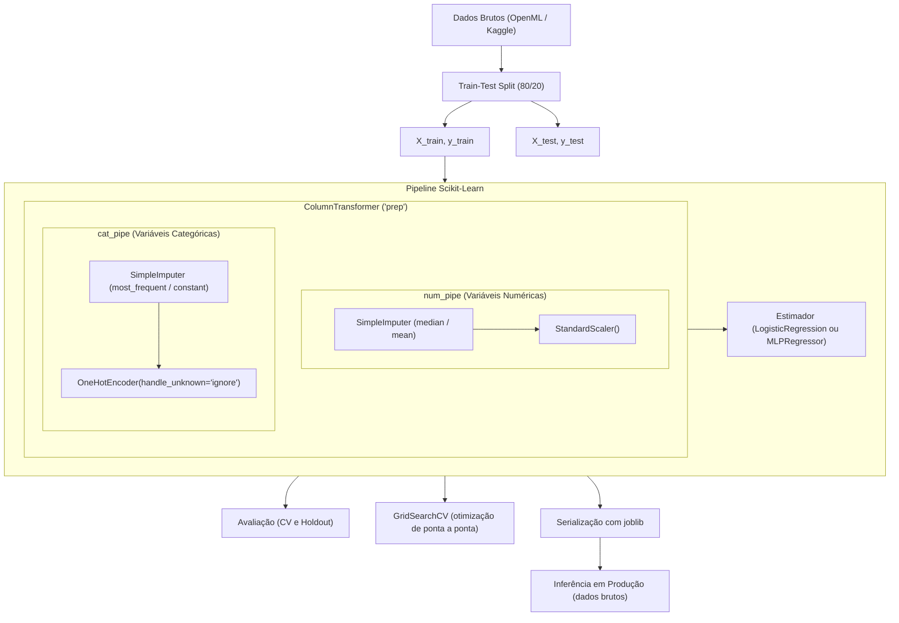

# Aula 5.3: Pipelines de Pré-processamento, Feature Engineering e Modelagem

Este módulo aborda a construção de pipelines robustos de Machine Learning com o Scikit-Learn. A aula está dividida em dois estudos de caso complementares:

1. **Classificação Binária (Titanic)**: `titanic.ipynb` - Predição de sobrevivência de passageiros utilizando Regressão Logística.
2. **Regressão com Redes Neurais (Students Performance)**: `students.ipynb` - Predição da nota final de estudantes (G3) utilizando `MLPRegressor`.

Ambos os projetos demonstram boas práticas de engenharia de dados, prevenção de vazamento de dados (*data leakage*), transformações customizadas, interpretabilidade, busca de hiperparâmetros e persistência de modelos para produção.

---

## Objetivos de Aprendizado

- **Prevenção de Data Leakage**: Garantir que transformações estatísticas (média, mediana, desvio padrão) sejam calculadas estritamente nas dobras de treino.
- **Transformações Heterogêneas**: Tratar variáveis numéricas e categóricas de forma modular utilizando `ColumnTransformer`.
- **Seleção Dinâmica vs. Manual de Features**: Explorar tanto a especificação explícita de colunas quanto a seleção dinâmica baseada em tipos de dados (`select_dtypes`).
- **Encadeamento e Pipelines Aninhados**: Construir pipelines modulares para imputação, escalonamento e codificação.
- **Diferenças entre Classificação e Regressão nos Pipelines**:
  - Classificação: Divisão estratificada (`stratify=y`), métricas como acurácia e probabilidades (`predict_proba`).
  - Regressão: Divisão contínua (sem estratificação), métricas como coeficiente de determinação ($R^2$) e predições contínuas (`predict`).
- **Feature Engineering Avançada**:
  - Transformações com `FunctionTransformer` (ex.: logarítmica com `np.log1p` para tratar assimetria).
  - Criação de transformadores personalizados via herança de `BaseEstimator` e `TransformerMixin`.
- **Interpretabilidade**:
  - Modelos Lineares: Inspeção direta de coeficientes associados a `get_feature_names_out()`.
  - Redes Neurais (MLP): Análise de relevância via soma do valor absoluto dos pesos que conectam as features de entrada aos neurônios da primeira camada oculta.
- **Otimização Global (`GridSearchCV`)**: Ajustar hiperparâmetros de pré-processamento e do modelo conjuntamente.
- **Serialização e Deploy (`joblib`)**: Salvar e carregar pipelines completos, permitindo inferência direta sobre novos dados brutos em formato de dicionário ou DataFrame.

---

## Comparativo dos Estudos de Caso

| Aspecto | Titanic (`titanic.ipynb`) | Students Performance (`students.ipynb`) |
| :--- | :--- | :--- |
| **Tipo de Problema** | Classificação Binária | Regressão |
| **Origem dos Dados** | OpenML (`fetch_openml`) | Kaggle via `kagglehub` (`student_data.csv`) |
| **Variável Alvo** | `survived` (0 ou 1) | `G3` (nota final, contínua) |
| **Algoritmo Base** | `LogisticRegression(max_iter=1000)` | `MLPRegressor(hidden_layer_sizes=(100,))` |
| **Seleção de Colunas** | Manual (listas explícitas) | Automática por tipo (`select_dtypes`) |
| **Estratificação no Split** | Sim (`stratify=y`) | Não (variável alvo contínua) |
| **Métrica Principal** | Acurácia | Coeficiente de Determinação ($R^2$) |
| **Interpretabilidade** | Coeficientes lineares diretos | Soma das magnitudes absolutas dos pesos da camada 1 |
| **Artefato Salvo** | `titanic_pipe.joblib` | `students.joblib` |

---

## Arquitetura Geral do Pipeline



---

## Estudo de Caso 1: Classificação no Titanic (`titanic.ipynb`)

### 1. Carregamento e Preparação
Carregamento direto via OpenML e seleção das variáveis:

```python
df = fetch_openml("titanic", version=1, as_frame=True).frame
df = df[["survived", "pclass", "sex", "age", "sibsp", "parch", "fare", "embarked"]]
df["survived"] = df["survived"].astype(int)

X = df.drop(columns="survived")
y = df["survived"]

X_train, X_test, y_train, y_test = train_test_split(
    X, y, test_size=0.2, stratify=y, random_state=42
)
```

### 2. Especificação Explícita e Asserção de Colunas
Garante que nenhuma coluna seja omitida por acidente:

```python
num_cols = ["age", "fare", "sibsp", "parch"]
cat_cols = ["sex", "embarked", "pclass"]

assert set(num_cols + cat_cols) == set(X_train.columns)
```

### 3. Pipeline e Regressão Logística
Combinação do pré-processamento com a regressão logística:

```python
num_pipe = Pipeline([
    ("imputer", SimpleImputer(strategy="median")),
    ("scaler", StandardScaler()),
], verbose=True)

cat_pipe = Pipeline([
    ("imputer", SimpleImputer(strategy="most_frequent")),
    ("onehot", OneHotEncoder(handle_unknown="ignore", sparse_output=False)),
], verbose=True)

preprocessor = ColumnTransformer([
    ("num", num_pipe, num_cols),
    ("cat", cat_pipe, cat_cols),
], verbose_feature_names_out=True, verbose=True)

pipe = Pipeline([
    ("prep", preprocessor),
    ("clf", LogisticRegression(max_iter=1000)),
], verbose=True)

pipe.fit(X_train, y_train)
test_acc = pipe.score(X_test, y_test) # ~80.53% de acurácia
```

### 4. Interpretabilidade por Coeficientes
```python
names = pipe.named_steps["prep"].get_feature_names_out()
coefs = pipe.named_steps["clf"].coef_[0]
pd.Series(coefs, index=names).sort_values()
```
- **Fatores negativos:** Sexo masculino (`cat__sex_male`), 3ª classe (`cat__pclass_3`) e idade elevada (`num__age`).
- **Fatores positivos:** Porto de embarque C (`cat__embarked_C`) e 1ª classe (`cat__pclass_1`).

---

## Estudo de Caso 2: Regressão no Student Performance (`students.ipynb`)

### 1. Carregamento via KaggleHub
Os dados são baixados e carregados diretamente via biblioteca `kagglehub`:

```python
import kagglehub
from kagglehub import KaggleDatasetAdapter

file_path = "student_data.csv"
df = kagglehub.dataset_load(
    KaggleDatasetAdapter.PANDAS,
    "devansodariya/student-performance-data",
    file_path,
)
```

O dataset contém 395 observações e 33 atributos socioeconômicos e escolares.

### 2. Definição do Alvo e Divisão dos Dados
O alvo é a nota final `G3`. Como se trata de regressão contínua, **não** se utiliza `stratify`:

```python
TARGET = "G3"
X = df.drop(columns=[TARGET])
y = df[TARGET]

X_train, X_test, y_train, y_test = train_test_split(
    X, y, test_size=0.2, random_state=42
)
```

### 3. Seleção Dinâmica de Colunas por Tipo de Dados
Diferente do Titanic, aqui as colunas numéricas e categóricas são selecionadas programaticamente a partir de seus tipos (`dtypes`):

```python
num_cols = X_train.select_dtypes(include=["int64", "float64"]).columns
cat_cols = X_train.select_dtypes(include=["str"]).columns

assert set(num_cols.union(cat_cols)) == set(X_train.columns), "Colunas faltantes em num_cols ou cat_cols"
```

O pré-processador resultante expande os 32 atributos preditores para 58 features prontas para treinamento após o One-Hot Encoding.

### 4. Modelagem com Redes Neurais (`MLPRegressor`)
O pipeline integra o pré-processamento a um perceptron multicamadas com regularização e parada antecipada:

```python
from sklearn.neural_network import MLPRegressor

pipe = Pipeline([
    ("prep", prep),
    ("model", MLPRegressor(
        hidden_layer_sizes=(100,),
        activation="relu",
        solver="adam",
        max_iter=1000,
        early_stopping=True,
        random_state=42
    )),
])

scores = cross_val_score(pipe, X_train, y_train, cv=5, scoring="r2")
print(f"R² médio no CV: {scores.mean():.4f} (+/- {scores.std():.4f})") # ~0.7954
```

No conjunto de teste holdout, o modelo atinge $R^2 \approx 0.6815$.

### 5. Interpretabilidade em Redes Neurais (Importância dos Pesos de Entrada)
Em redes MLP, não há um coeficiente direto por classe como na regressão linear. Uma abordagem eficaz para mensurar a importância relativa das features é somar os valores absolutos dos pesos que saem de cada feature de entrada para todos os neurônios da primeira camada oculta (`coefs_[0]`):

```python
names = pipe.named_steps["prep"].get_feature_names_out()

# coefs_[0] possui dimensionalidade (n_features, n_neuronios)
weights_input = np.abs(pipe.named_steps["model"].coefs_[0]).sum(axis=1)

importance = pd.Series(weights_input, index=names).sort_values(ascending=False)
```

Principais preditores identificados pela rede neural:
1. `num__G2`: Nota do segundo período (forte relação com a nota final).
2. `num__absences`: Quantidade de faltas escolares.
3. `num__G1`: Nota do primeiro período.
4. `num__studytime`: Tempo dedicado aos estudos semanais.
5. `cat__higher_no`: Desejo declarado de não ingressar no ensino superior.

### 6. Busca de Hiperparâmetros (`GridSearchCV`)
Otimização conjunta da arquitetura de rede neural, fator de regularização L2 (`alpha`) e estratégias de imputação:

```python
grid = {
    "prep__num__imputer__strategy": ["median", "mean"],
    "prep__cat__imputer__strategy": ["most_frequent", "constant"],
    "model__hidden_layer_sizes": [(50,), (100,), (64, 32)],
    "model__alpha": [0.0001, 0.01, 0.1],
}

gs = GridSearchCV(pipe, grid, cv=5, scoring="r2", n_jobs=-1)
gs.fit(X_train, y_train)
```

- **Melhores Parâmetros:** `{'model__alpha': 0.0001, 'model__hidden_layer_sizes': (64, 32), 'prep__cat__imputer__strategy': 'most_frequent', 'prep__num__imputer__strategy': 'median'}`
- **Melhor $R^2$ obtido na validação cruzada:** `0.8014` (superando o baseline de 0.7954).

---

## Transformações Avançadas e Engenharia de Atributos

### Transformação Logarítmica com `FunctionTransformer`
Utilizada para corrigir assimetria em variáveis numéricas com valores positivos elevados:

```python
log_fare = Pipeline([
    ("imputer", SimpleImputer(strategy="median")),
    ("log", FunctionTransformer(np.log1p, feature_names_out="one-to-one")),
    ("scaler", StandardScaler())
])
```

### Transformador Personalizado Scikit-Learn
Implementação de transformadores customizados integráveis em pipelines e `GridSearchCV`:
- `BaseEstimator`: Fornece `get_params` e `set_params` para controle de hiperparâmetros.
- `TransformerMixin`: Implementa automaticamente o método `fit_transform`.
- `get_feature_names_out`: Mantém a rastreabilidade dos nomes de colunas.

```python
from sklearn.base import BaseEstimator, TransformerMixin

class TamanhoFamilia(BaseEstimator, TransformerMixin):
    def fit(self, X, y=None):
        return self

    def transform(self, X):
        familia = X["sibsp"] + X["parch"] + 1
        return familia.to_frame("familia")

    def get_feature_names_out(self, input_features=None):
        return np.array(["familia"])
```

---

## Persistência de Modelos e Simulação de Produção (`joblib`)

Ambos os notebooks demonstram como serializar o objeto de pipeline completo e realizar inferência sobre novos dados brutos:

### Exportação
```python
# Titanic
joblib.dump(pipe, "titanic_pipe.joblib")

# Students
joblib.dump(pipe, "students.joblib")
```

### Simulação de Inferência em Produção
O pipeline encapsulado trata automaticamente dados faltantes, faz a codificação one-hot com as categorias conhecidas no treino e realiza a predição sem risco de desalinhamento (*skew*):

```python
model = joblib.load("students.joblib")

novo_aluno = pd.DataFrame([{
    "school": "GP", "sex": "F", "age": 18, "address": "U", "famsize": "GT3",
    "Pstatus": "A", "Medu": 4, "Fedu": 4, "Mjob": "at_home", "Fjob": "teacher",
    "reason": "course", "guardian": "mother", "traveltime": 1, "studytime": 2,
    "failures": 0, "schoolsup": "no", "famsup": "yes", "paid": "no",
    "activities": "yes", "nursery": "yes", "higher": "yes", "internet": "yes",
    "romantic": "no", "famrel": 4, "freetime": 3, "goout": 3, "Dalc": 1,
    "Walc": 1, "health": 5, "absences": 4, "G1": 15, "G2": 14
}])

nota_predita = model.predict(novo_aluno)[0].round(3)
print(f"Nota final prevista: {nota_predita}") # Resultado: ~14.962
```

---

## Boas Práticas Consolidadas

1. **Evitar Data Leakage**: O cálculo de métricas de imputação (médias/medianas) e escalas de normalização ocorre apenas nos dados de treino de cada dobra.
2. **One-Hot Encoding Resiliente**: O parâmetro `handle_unknown="ignore"` evita que categorias novas encontradas em produção quebrem a execução do pipeline.
3. **Controle de Tipos e Asserções**: O uso de asserções (`assert`) garante consistência no esquema das features durante a evolução dos scripts.
4. **Alinhamento de Treino e Servidão**: Salvar o pipeline completo em vez de apenas os pesos do modelo elimina inconsistências entre as etapas de pré-processamento manual e o algoritmo preditivo.
